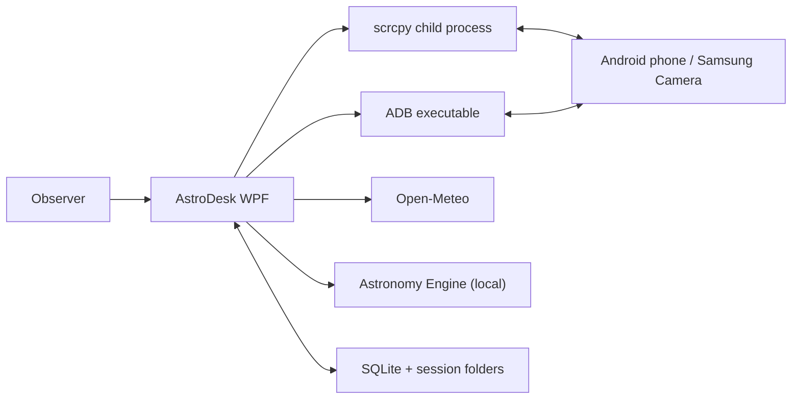
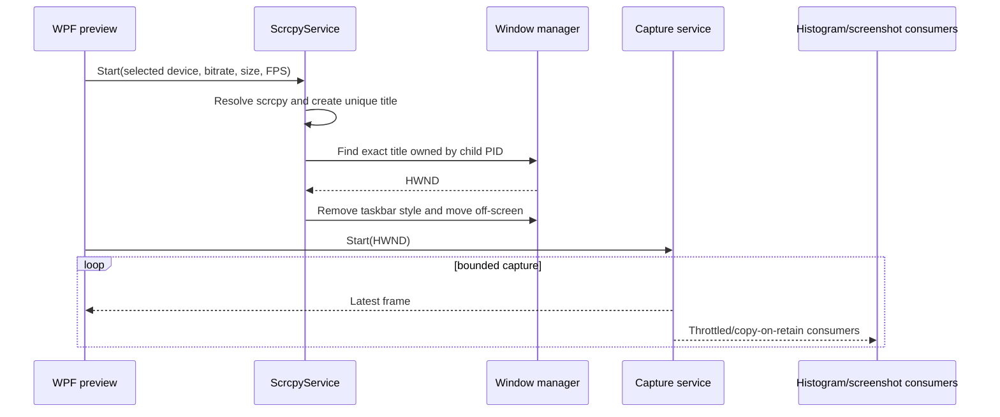
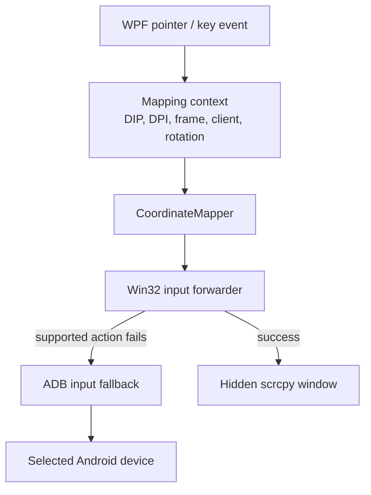

# AstroDesk architecture

AstroDesk is a local-first .NET 8 WPF application organized around the actual phone-assisted astrophotography workflow. The architecture keeps device I/O, capture, domain rules, persistence, providers, and WPF presentation separate so that a failure in one boundary does not invalidate an active shooting session.

The most important design constraint is that AstroDesk does not reimplement the scrcpy protocol. scrcpy remains the mirroring and device-control engine. AstroDesk manages its process and window, captures that window for presentation, and forwards mapped input back to it.

## System context



Online weather and geocoding are opt-in and disabled by default. When enabled, Open-Meteo receives the selected coordinates for weather and the entered search text for geocoding. Device mirroring/control, local astronomy calculations, session management, and persistence do not require an AstroDesk account or cloud service.

## Solution projects

| Project                         | Responsibility                                                                                                                    | Important boundaries                                                            |
| ------------------------------- | --------------------------------------------------------------------------------------------------------------------------------- | ------------------------------------------------------------------------------- |
| `src/AstroDesk.App`             | WPF application, controls, views, view models, navigation, theme, composition root                                                | May reference all application services; should contain little domain logic      |
| `src/AstroDesk.Core`            | Domain entities, enums, provider/persistence interfaces, session lifecycle, exposure and meteorology calculations                 | Platform-independent; no WPF, Win32, EF Core, HTTP, ADB, or scrcpy dependencies |
| `src/AstroDesk.Device`          | Executable discovery, child processes, ADB, scrcpy lifecycle, window management, input translation/forwarding, toolbar routing    | Windows/device boundary; raw serial values must be treated as sensitive         |
| `src/AstroDesk.Capture`         | Window capture abstraction/backend, frames, bounded delivery, coordinate mapping, zoom, overlays, histograms, preview screenshots | Owns unmanaged image/capture resources and must dispose them promptly           |
| `src/AstroDesk.Data`            | EF Core SQLite context, configurations, migrations, repositories, database initialization                                         | Implements Core persistence interfaces; SQLite is the source of truth           |
| `src/AstroDesk.Infrastructure`  | Weather, astronomy, location, file exports, application paths, rolling logs                                                       | Integrates replaceable providers and local filesystem concerns                  |
| `tests/AstroDesk.Core.Tests`    | Domain, settings, SQLite repository, migration/initialization, and calculation tests                                              | No device required                                                              |
| `tests/AstroDesk.Device.Tests`  | ADB parsing, process behavior, scrcpy arguments/lifecycle, and input translation tests                                            | Uses fakes for external executables and windows                                 |
| `tests/AstroDesk.Capture.Tests` | Coordinate mapping, zoom, and histogram tests                                                                                     | Capture API itself remains a Windows integration-test boundary                  |

The intended dependency direction is:

```text
AstroDesk.App
├── AstroDesk.Core
├── AstroDesk.Device
├── AstroDesk.Capture
├── AstroDesk.Data ──────────> AstroDesk.Core
└── AstroDesk.Infrastructure ─> AstroDesk.Core

AstroDesk.Device and AstroDesk.Capture do not depend on WPF application state.
AstroDesk.Core does not depend on any outer project.
```

## Runtime composition

The WPF application is the composition root. It is responsible for:

- creating the host and dependency-injection container;
- loading non-secret configuration;
- creating application data directories;
- configuring console/debug and rolling-file logging;
- applying EF Core migrations and checking SQLite integrity;
- constructing the main window and view models;
- starting device/provider background services after startup succeeds; and
- cancelling and disposing background work during application shutdown.

Services with external resources should be registered according to their ownership:

- singleton for process, monitor, capture, path, provider, and application-state coordinators that live for the application;
- scoped for EF Core contexts and repository operations; and
- transient for lightweight view models or stateless helpers where a shorter lifetime is useful.

No service should resolve dependencies through a global service locator.

## Embedded preview flow



The current backend is `Win32WindowCaptureService`. It attempts `PrintWindow` for the client area and falls back to `BitBlt`. `IWindowCaptureService` is the stable boundary for a future Windows Graphics Capture backend. Documentation and UI must not describe the current backend as Windows Graphics Capture.

Capture uses a bounded channel with capacity two. When the consumer falls behind, an older frame is disposed and replaced rather than allowing an unbounded backlog. A frame supplied through `FrameArrived` is valid only for the callback; consumers that retain pixels must copy them.

## Input flow



Direct forwarding is preferred because it preserves scrcpy's responsive control path. ADB fallback is deliberately limited to supported taps, swipes, key events, text, and keep-awake commands. It requires an explicitly selected authorized device.

`CoordinateMapper` treats these as separate spaces:

1. embedded WPF coordinates in device-independent pixels;
2. the rendered preview rectangle after fit/pixel-perfect letterboxing;
3. captured-frame pixels;
4. scrcpy client-area pixels; and
5. normalized coordinates before/after rotation.

See [INPUT_MAPPING.md](INPUT_MAPPING.md) for the mapping contract.

## Device monitoring

`AdbService` resolves `adb.exe`, requests `adb devices -l`, parses device states, and retrieves optional phone status with individual commands. A missing optional value is represented as unavailable rather than synthesized.

`DeviceMonitor` serializes polling through a semaphore so explicit refreshes and timer refreshes cannot run ADB status work concurrently. It supports a configurable interval, reconnect cooldown, preferred device, cancellation, and non-fatal error snapshots.

Device serials are required internally to target commands. They are passed to process logging as sensitive values and redacted from command lines and diagnostic output.

## Domain and persistence

The main aggregate is `ShootingSession`. It enforces:

- planned, active, paused, and completed lifecycle transitions;
- valid timestamps and pause accounting;
- non-negative frame counts and durations;
- coordinate, ISO, rating, battery, and storage constraints;
- integration-time and remaining-time calculations; and
- association of weather, astronomy, notes, screenshots, and equipment.

SQLite contains:

- `AppSetting`
- `SavedLocation`
- `ShootingSession`
- `SessionWeatherSnapshot`
- `SessionAstronomySnapshot`
- `SessionScreenshot`
- `SessionNote`
- `EquipmentProfile`
- `OverlayPreset`

EF Core configurations define relationships, indexes, maximum lengths, enum conversions, and database constraints. A filtered unique index prevents more than one active/paused session.

Database startup:

1. creates the data directory;
2. opens SQLite;
3. enables foreign keys;
4. configures a busy timeout, WAL journal mode, and normal synchronous mode;
5. runs `PRAGMA quick_check`;
6. applies migrations; and
7. runs another integrity check.

The database is the source of truth. `SessionAssetService` creates human-portable folders and exports after persistence operations. Export failure should be reported without corrupting the stored session.

## Providers

Provider interfaces live in Core:

- `IWeatherProvider`
- `IAstronomyProvider`
- `ILocationProvider`

Current implementations:

- Open-Meteo current conditions, no API key;
- Open-Meteo geocoding search, no API key;
- Astronomy Engine calculations performed locally;
- explicit unavailable providers for disabled/unavailable cases; and
- seeded Lebanon examples for convenience, not geographic restriction.

Providers return no value when data is genuinely unavailable. Provider exceptions are logged and isolated from the session workflow. Weather/location network failure must not stop capture, device monitoring, session tracking, or local astronomy calculations.

## Threading, backpressure, and cancellation

- WPF-bound state changes are marshalled onto the UI dispatcher.
- Child-process output is drained asynchronously to avoid blocking scrcpy or ADB.
- Capture and image processing run away from the UI thread.
- Capture frames use bounded queues and drop stale work.
- Histogram processing is throttled, single-flight, and can be frozen.
- ADB monitor polls are serialized.
- Long-running services accept cancellation tokens.
- Shutdown cancels capture, monitoring, timers, and provider refreshes before disposing native/process resources.

Any new producer/consumer path must define its queue capacity and stale-work policy. An unbounded frame, log, timer, or provider queue is not acceptable.

## Failure isolation

| Failure                               | Expected behavior                                                                    |
| ------------------------------------- | ------------------------------------------------------------------------------------ |
| No ADB executable                     | Show actionable path/PATH guidance; keep local session features available            |
| Unauthorized/offline phone            | Show authorization/reconnect guidance; do not invent status                          |
| scrcpy missing or incompatible        | Stop preview startup with useful diagnostics; do not crash the app                   |
| scrcpy crash                          | Mark preview stopped/crashed, retain session state, allow reconnect                  |
| Window not found                      | Stop the partial child process and report the unique-title timeout                   |
| Capture failure                       | Show an error overlay and allow capture/scrcpy restart                               |
| Input forwarding failure              | Use an allowed ADB fallback when possible; otherwise report unsupported action       |
| Weather/location failure              | Display `Unavailable`; retain local astronomy and session workflow                   |
| Database corruption/locking/full disk | Stop unsafe persistence, preserve files, and present recovery guidance               |
| Sleep/wake or DPI/rotation change     | Re-query sizes/state and reconnect where possible; never reuse stale mapping blindly |

## Local paths and privacy

The default data root is `%LOCALAPPDATA%\AstroDesk`. It contains the SQLite database, session folders, preview screenshots, and rolling logs.

AstroDesk does not include telemetry, analytics, accounts, or cloud synchronization. Online providers receive only the request data required for their function, such as coordinates for a weather lookup or search text for geocoding. Screen frames, notes, phone status, and sessions are not sent to those providers.

## Architectural rules for contributions

- Keep Core platform-independent.
- Do not add AI, account, social, analytics, or telemetry features.
- Do not rebuild the scrcpy protocol.
- Do not use repeated ADB screenshots for live preview.
- Do not silently fake device, weather, astronomy, or location values.
- Keep device serials out of normal logs.
- Put Win32 and unmanaged code behind narrow interfaces.
- Add tests for coordinate, timing, lifecycle, parsing, persistence, and translation logic.
- Document experimental behavior at its UI boundary and keep it disabled by default.
- Link intentional implementation TODOs to an item in [ROADMAP.md](ROADMAP.md) or [.github/ISSUES_TO_CREATE.md](.github/ISSUES_TO_CREATE.md).
